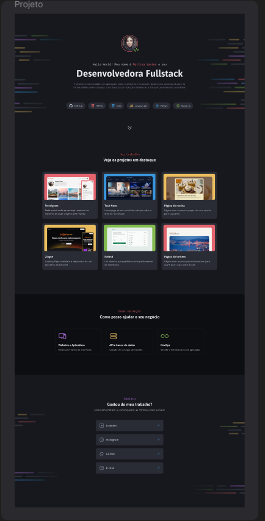

# 💼 Portfólio Pessoal - Desenvolvedor Front-end

Este projeto é um desafio prático para desenvolver um site de portfólio, com foco em HTML e CSS puro. O objetivo é aplicar os principais conceitos de layout e posicionamento.

---

## 🖼️ Preview



---

## 🚀 Sobre o projeto

O portfólio inclui uma seção de introdução, serviços, destaques de trabalho e redes sociais. O layout foi inspirado no modelo do Figma disponibilizado no desafio - Rocketseat.

🔗 **Link do Figma original:** [Abrir no Figma](https://www.figma.com/community/file/1387080701963671866/portfolio-dev)

---

## 🧠 Aprendizados aplicados

Durante o desenvolvimento, foram aplicados os seguintes conceitos:

- ✅ Criação de layouts com HTML e CSS
- ✅ Flexbox e Grid Layout
- ✅ Posicionamento absoluto e relativo
- ✅ Variáveis CSS
- ✅ Pseudo-classes e pseudo-elementos
- ✅ Responsividade com `min-height`, `max-height` e `object-fit: cover`

---

## 🛠 Tecnologias Utilizadas

Durante o projeto, foram aplicados os seguintes conhecimentos:


- ✅ Criação de layouts com CSS
- ✅ CSS Flexbox
- ✅ Posicionamento de elementos
- ✅ CSS Grid
- ✅ Variáveis CSS
- ✅ Pseudo-classes e pseudo-elementos


## 💻 Como rodar o projeto

1. Clone o repositório:
```bash
git clone https://github.com/YsraellSantos/portfolio-dev.git
